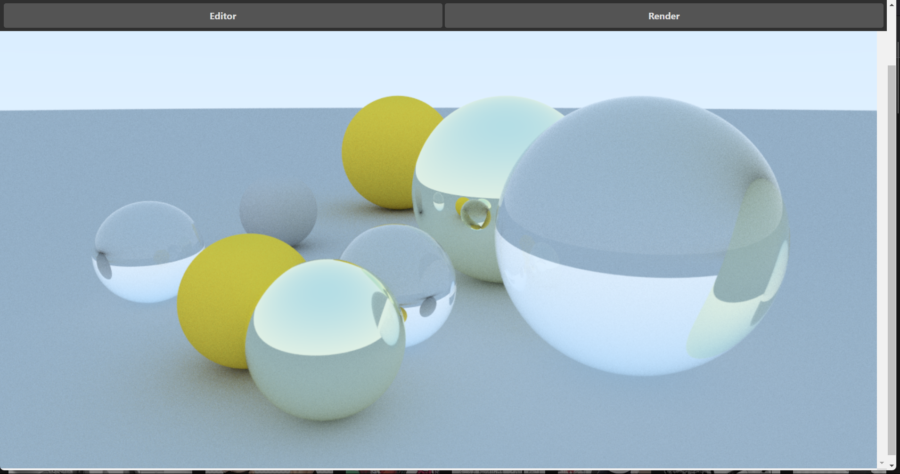

# SpRT

Simple raytracing engine using nodejs.

# To execute app in dev

> Open two terminals and execute these commands in order in two terminals  
> run 'npm run run-frontend'  
> run 'npm run execute-app'
>
> > > > > > > 687325db7cfe7393daf1a2c2870b2ed6a2fac1e3

# To build the project

> execute  
> run 'npm run build'  
> _final build avilable at out/make_

### Followed - https://raytracing.github.io/books/RayTracingInOneWeekend.html

## Sample images-

